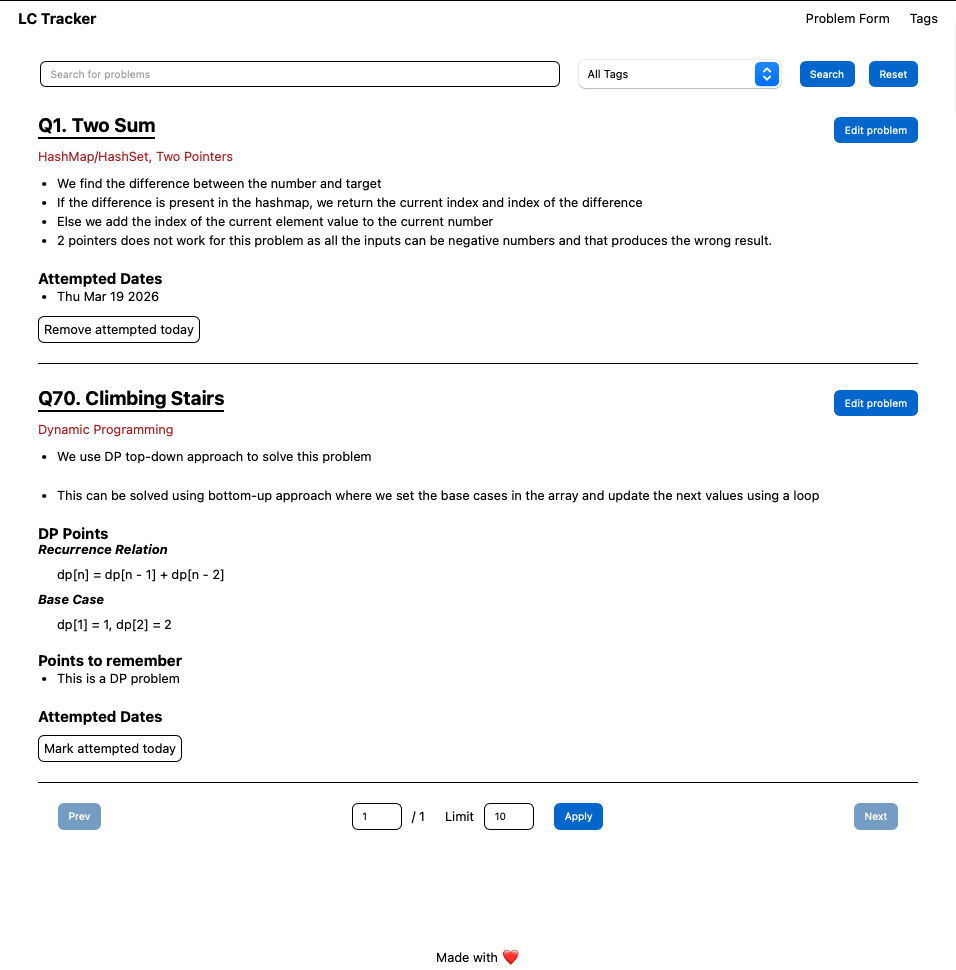
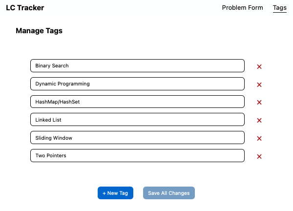

# Leetcode Tracker

A simple Leetcode Problem tracker built using VueJS and Express

## Technologies used

- VueJS
- Vue Router
- ExpressJS
- Mongoose

## Features

- Tags
  - Create tags for the problems

- Problems
  - Create problems with the following
    - Multiple Solutions
    - Tags
    - Recursive and Base case for DP problems
    - Points to remember
  - Problems can be marked as attempted today to keep track of attempts

- Search & Filter
  - Problems can be searched by Problem number or problem name
  - Problems can be filtered based on the tag

- Pagination
  - By default 10 problems are displayed
  - Limits for the count can be configured

## Installation

- Make sure MongoDB is installed and add the MongoDB URI to the .env file
- Frontend is already built and is served as static files from the backend

### Backend

```
cd backend
npm i
npm run dev
```

- The application can be accessed on http://localhost:5000

### Frontend

- You do not need to do this step if you do not want to build the application

```
cd frontend
npm i
npm run dev
```

- To build the frontend to 'backend/src/static'

```
cd frontend
npm i
npm run build
```

## Additional Notes

- This application has error handling
- Errors are displayed as a toast in frontend
- Logging is added in the backend

## Demo




